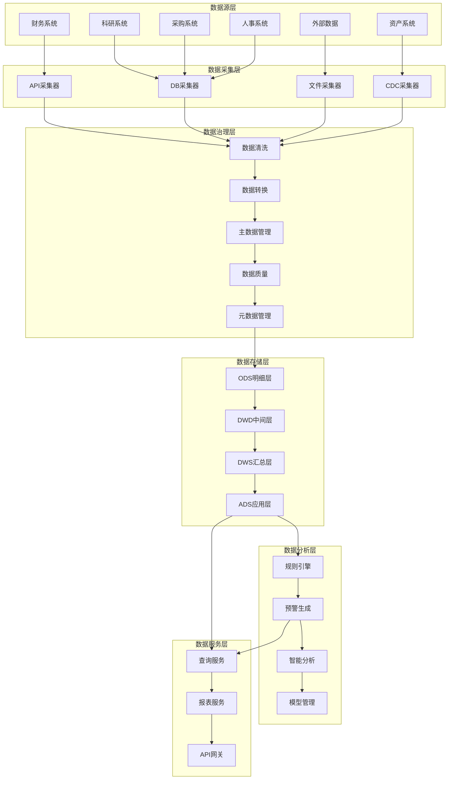
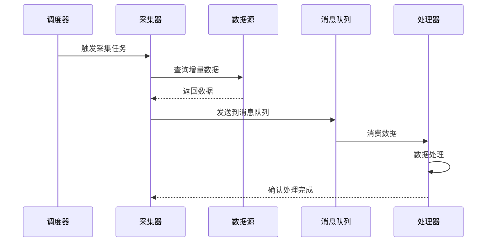
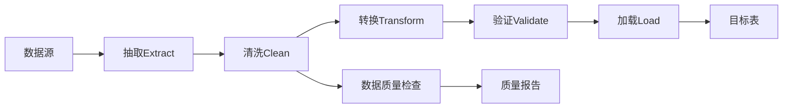
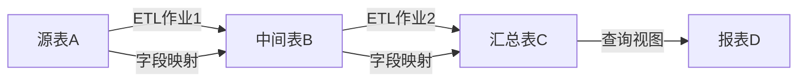
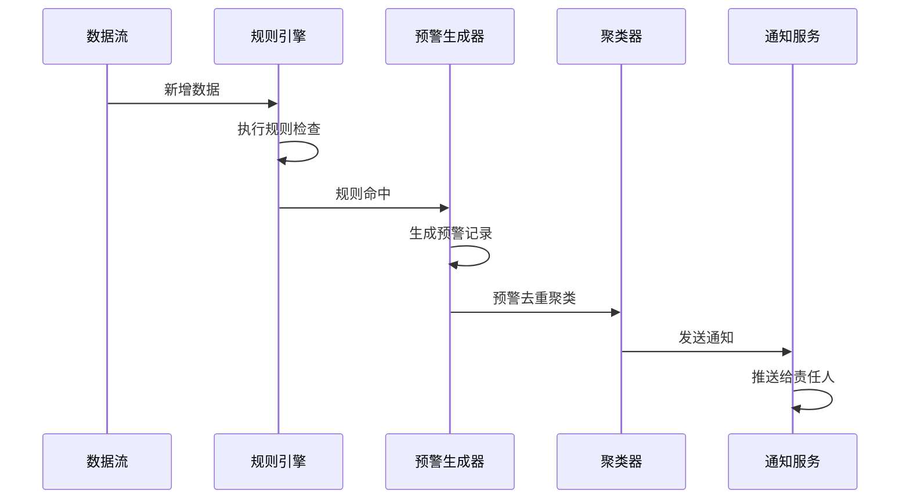
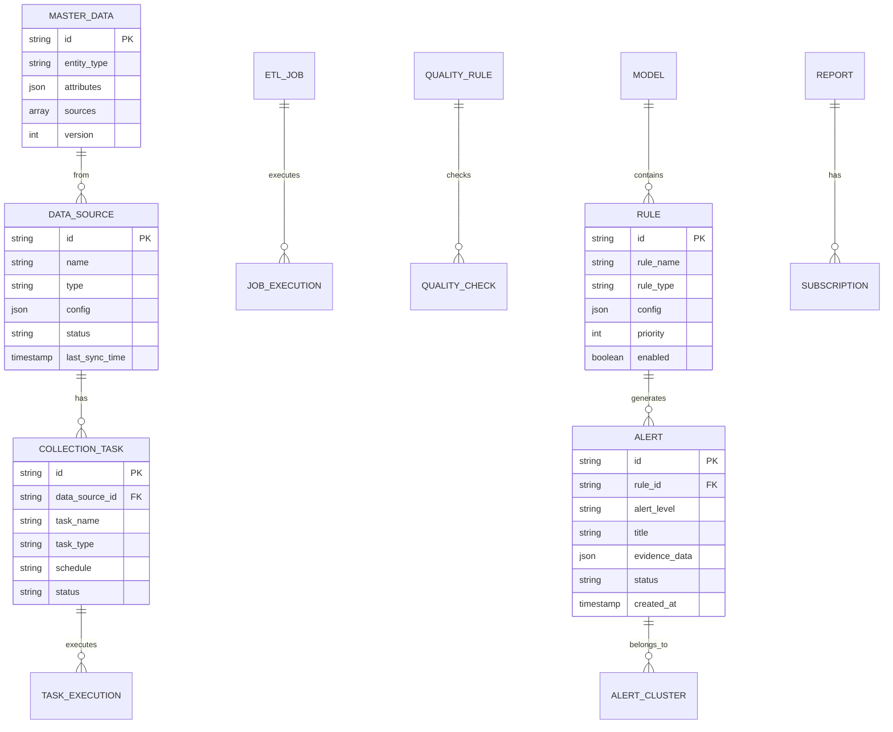

# 设计文档

## 概述

数据采集与治理、数据分析与预警模块是高校纪检审计监管一体化平台的数据中台,负责从多个业务系统采集数据,经过标准化治理后存储到数据仓库,并通过规则引擎和智能分析技术自动识别风险,生成预警信息。

本模块采用分层架构设计:
- **数据采集层**: 负责从多源异构系统采集数据
- **数据治理层**: 负责数据清洗、转换、质量管理
- **数据存储层**: 负责数据仓库分层存储
- **数据分析层**: 负责规则引擎、智能分析、预警生成
- **数据服务层**: 负责对外提供数据查询和分析服务

设计遵循以下原则:
- **松耦合**: 各层之间通过标准接口交互,降低耦合度
- **可扩展**: 支持新增数据源、规则、模型的灵活扩展
- **高性能**: 采用增量同步、流式处理、分布式计算提升性能
- **高可用**: 关键组件支持集群部署和故障转移
- **安全可控**: 全链路数据加密、脱敏、审计

## 架构设计

### 系统架构



### 技术架构

**数据采集技术**
- API采集: RESTful API / SOAP / GraphQL
- 数据库采集: JDBC / ODBC 直连
- CDC采集: Debezium / Canal / Maxwell
- 文件采集: FTP / SFTP / OSS

**数据处理技术**
- ETL工具: Apache NiFi / Kettle / DataX
- 流式处理: Apache Flink / Kafka Streams
- 批处理: Apache Spark / Hive

**数据存储技术**
- 关系数据库: PostgreSQL / MySQL (主数据、元数据)
- 数据仓库: ClickHouse / Greenplum (分析型数据)
- 对象存储: MinIO / OSS (文件、影像)
- 缓存: Redis (热点数据、会话)

**分析引擎技术**
- 规则引擎: Drools / Easy Rules
- 图计算: Neo4j / JanusGraph
- NLP: HanLP / jieba / BERT
- OCR: Tesseract / PaddleOCR

**前端技术**
- 框架: Vue.js 3 / React
- 图表: ECharts / D3.js
- 图谱: G6 / Cytoscape.js

## 组件设计

### 1. 数据源管理组件

**功能**
- 数据源配置管理
- 连接健康监控
- 连接池管理
- 访问日志记录

**接口设计**
```javascript
// 数据源配置
interface DataSource {
    id: string;
    name: string;
    type: 'API' | 'DATABASE' | 'FILE' | 'CDC';
    config: {
        host?: string;
        port?: number;
        database?: string;
        username?: string;
        password?: string;
        apiUrl?: string;
        apiKey?: string;
        filePath?: string;
    };
    status: 'ACTIVE' | 'INACTIVE' | 'ERROR';
    lastSyncTime: Date;
    createdAt: Date;
    updatedAt: Date;
}

// 数据源服务接口
interface DataSourceService {
    create(dataSource: DataSource): Promise<DataSource>;
    update(id: string, dataSource: Partial<DataSource>): Promise<DataSource>;
    delete(id: string): Promise<void>;
    testConnection(id: string): Promise<boolean>;
    getHealthStatus(id: string): Promise<HealthStatus>;
    list(filter?: DataSourceFilter): Promise<DataSource[]>;
}
```

### 2. 数据采集组件

**功能**
- 全量/增量数据采集
- CDC变更捕获
- 采集任务调度
- 失败重试机制

**数据流设计**


**接口设计**
```javascript
// 采集任务配置
interface CollectionTask {
    id: string;
    dataSourceId: string;
    taskName: string;
    taskType: 'FULL' | 'INCREMENTAL' | 'CDC';
    schedule: string; // Cron表达式
    query?: string; // SQL查询或API路径
    incrementalField?: string; // 增量字段
    lastValue?: any; // 上次采集的最大值
    status: 'RUNNING' | 'STOPPED' | 'ERROR';
    retryCount: number;
    maxRetries: number;
}

// 采集服务接口
interface CollectionService {
    createTask(task: CollectionTask): Promise<CollectionTask>;
    executeTask(taskId: string): Promise<CollectionResult>;
    stopTask(taskId: string): Promise<void>;
    getTaskStatus(taskId: string): Promise<TaskStatus>;
    getTaskLogs(taskId: string, limit: number): Promise<TaskLog[]>;
}
```

### 3. ETL处理组件

**功能**
- 可视化ETL设计器
- 数据清洗转换
- 字段映射配置
- 作业版本管理

**ETL流程设计**


**接口设计**
```javascript
// ETL作业配置
interface ETLJob {
    id: string;
    jobName: string;
    version: string;
    sourceConfig: {
        dataSourceId: string;
        query: string;
    };
    transformRules: TransformRule[];
    targetConfig: {
        tableName: string;
        writeMode: 'INSERT' | 'UPDATE' | 'UPSERT';
    };
    schedule?: string;
    status: 'DRAFT' | 'PUBLISHED' | 'ARCHIVED';
}

// 转换规则
interface TransformRule {
    type: 'MAP' | 'FILTER' | 'CALCULATE' | 'SPLIT' | 'MERGE';
    sourceFields: string[];
    targetField: string;
    expression?: string; // 计算表达式
    condition?: string; // 过滤条件
}

// ETL服务接口
interface ETLService {
    createJob(job: ETLJob): Promise<ETLJob>;
    executeJob(jobId: string): Promise<ExecutionResult>;
    getJobHistory(jobId: string): Promise<JobExecution[]>;
    rollbackVersion(jobId: string, version: string): Promise<ETLJob>;
}
```

### 4. 主数据管理组件

**功能**
- 主数据去重识别
- 主数据合并
- 全局唯一标识生成
- 主数据变更历史

**数据模型**
```javascript
// 主数据实体
interface MasterData {
    id: string; // 全局唯一标识
    entityType: 'PERSON' | 'ORGANIZATION' | 'SUPPLIER' | 'PROJECT' | 'CONTRACT';
    attributes: Record<string, any>; // 属性字典
    sources: DataSource[]; // 来源系统
    mergedFrom?: string[]; // 合并来源ID
    version: number;
    createdAt: Date;
    updatedAt: Date;
}

// 主数据服务接口
interface MasterDataService {
    create(entity: MasterData): Promise<MasterData>;
    findDuplicates(entity: MasterData): Promise<MasterData[]>;
    merge(sourceIds: string[], targetId: string): Promise<MasterData>;
    getHistory(id: string): Promise<MasterDataHistory[]>;
    search(query: MasterDataQuery): Promise<MasterData[]>;
}
```

### 5. 数据质量管理组件

**功能**
- 质量规则配置
- 自动质量检查
- 质量评分计算
- 质量异常工单

**质量规则类型**
- 完整性规则: 非空检查、必填字段检查
- 准确性规则: 格式校验、范围校验、枚举值校验
- 一致性规则: 跨表一致性、主外键一致性
- 及时性规则: 数据时效性检查

**接口设计**
```javascript
// 质量规则
interface QualityRule {
    id: string;
    ruleName: string;
    ruleType: 'COMPLETENESS' | 'ACCURACY' | 'CONSISTENCY' | 'TIMELINESS';
    targetTable: string;
    targetField?: string;
    checkExpression: string; // SQL表达式或脚本
    threshold: number; // 合格阈值
    severity: 'HIGH' | 'MEDIUM' | 'LOW';
    enabled: boolean;
}

// 质量检查结果
interface QualityCheckResult {
    ruleId: string;
    checkTime: Date;
    totalRecords: number;
    passedRecords: number;
    failedRecords: number;
    score: number; // 0-100
    status: 'PASS' | 'FAIL';
    issues: QualityIssue[];
}

// 质量服务接口
interface QualityService {
    createRule(rule: QualityRule): Promise<QualityRule>;
    executeCheck(ruleId: string): Promise<QualityCheckResult>;
    getQualityReport(tableName: string): Promise<QualityReport>;
    createIssueTicket(issue: QualityIssue): Promise<Ticket>;
}
```

### 6. 元数据管理组件

**功能**
- 元数据自动采集
- 元数据目录服务
- 数据血缘追踪
- 影响分析

**血缘关系模型**


**接口设计**
```javascript
// 元数据
interface Metadata {
    id: string;
    objectType: 'TABLE' | 'FIELD' | 'JOB' | 'REPORT';
    objectName: string;
    description?: string;
    properties: Record<string, any>;
    tags: string[];
    owner: string;
    createdAt: Date;
    updatedAt: Date;
}

// 血缘关系
interface Lineage {
    sourceId: string;
    targetId: string;
    relationType: 'DERIVE' | 'DEPEND' | 'REFERENCE';
    transformLogic?: string;
}

// 元数据服务接口
interface MetadataService {
    register(metadata: Metadata): Promise<Metadata>;
    search(keyword: string): Promise<Metadata[]>;
    getLineage(objectId: string, direction: 'UPSTREAM' | 'DOWNSTREAM'): Promise<Lineage[]>;
    analyzeImpact(objectId: string): Promise<ImpactAnalysis>;
}
```

### 7. 数据仓库组件

**分层设计**

**ODS层 (Operational Data Store)**
- 保持与源系统一致的数据结构
- 记录数据采集时间戳
- 支持全量和增量数据

**DWD层 (Data Warehouse Detail)**
- 按主题域整合数据
- 统一数据标准和编码
- 建立维度表和事实表

**DWS层 (Data Warehouse Summary)**
- 轻度汇总数据
- 按时间、部门等维度预聚合
- 提升查询性能

**ADS层 (Application Data Store)**
- 面向应用的数据集市
- 指标数据、报表数据
- 直接支撑业务查询

**表设计示例**
```sql
-- ODS层: 原始采购数据
CREATE TABLE ods_procurement (
    id VARCHAR(50),
    project_name VARCHAR(200),
    amount DECIMAL(18,2),
    supplier_id VARCHAR(50),
    contract_date DATE,
    source_system VARCHAR(50),
    load_time TIMESTAMP
);

-- DWD层: 采购事实表
CREATE TABLE dwd_fact_procurement (
    procurement_id VARCHAR(50),
    project_dim_id VARCHAR(50),
    supplier_dim_id VARCHAR(50),
    department_dim_id VARCHAR(50),
    date_dim_id VARCHAR(50),
    amount DECIMAL(18,2),
    status VARCHAR(20),
    created_at TIMESTAMP
);

-- DWS层: 部门采购汇总
CREATE TABLE dws_dept_procurement_summary (
    dept_id VARCHAR(50),
    year_month VARCHAR(7),
    total_amount DECIMAL(18,2),
    project_count INT,
    avg_amount DECIMAL(18,2),
    updated_at TIMESTAMP
);

-- ADS层: 采购监督指标
CREATE TABLE ads_procurement_metrics (
    metric_date DATE,
    dept_id VARCHAR(50),
    total_procurement DECIMAL(18,2),
    over_budget_count INT,
    split_procurement_count INT,
    risk_level VARCHAR(20)
);
```

### 8. 规则引擎组件

**功能**
- 规则配置管理
- 规则执行引擎
- 规则测试回测
- 规则优先级管理

**规则类型**

**阈值规则**
```javascript
{
    type: 'THRESHOLD',
    field: 'amount',
    operator: '>',
    threshold: 100000,
    message: '采购金额超过10万元'
}
```

**趋势规则**
```javascript
{
    type: 'TREND',
    field: 'expense',
    timeWindow: '30d',
    condition: 'increase > 50%',
    message: '费用增长超过50%'
}
```

**关联规则**
```javascript
{
    type: 'CORRELATION',
    entities: ['person', 'supplier'],
    relation: 'family_relation',
    message: '采购人员与供应商存在亲属关系'
}
```

**时序规则**
```javascript
{
    type: 'SEQUENCE',
    events: ['approval_skip', 'payment_advance'],
    timeWindow: '7d',
    message: '跳过审批后提前付款'
}
```

**图谱规则**
```javascript
{
    type: 'GRAPH',
    pattern: 'person->company->contract',
    condition: 'person.role=approver AND company.owner=person.relative',
    message: '审批人亲属企业中标'
}
```

**接口设计**
```javascript
// 规则配置
interface Rule {
    id: string;
    ruleName: string;
    ruleType: 'THRESHOLD' | 'TREND' | 'CORRELATION' | 'SEQUENCE' | 'GRAPH';
    category: string; // 规则分类: 采购、财务、科研等
    config: RuleConfig;
    priority: number;
    enabled: boolean;
    alertLevel: 'HIGH' | 'MEDIUM' | 'LOW';
    notifyStrategy: NotifyStrategy;
}

// 规则执行结果
interface RuleExecutionResult {
    ruleId: string;
    executionTime: Date;
    matchedCount: number;
    alerts: Alert[];
    executionDuration: number;
}

// 规则服务接口
interface RuleService {
    createRule(rule: Rule): Promise<Rule>;
    executeRule(ruleId: string, data?: any): Promise<RuleExecutionResult>;
    testRule(rule: Rule, testData: any): Promise<TestResult>;
    backtest(ruleId: string, startDate: Date, endDate: Date): Promise<BacktestResult>;
    optimizeRule(ruleId: string, feedback: Feedback[]): Promise<OptimizationSuggestion>;
}
```

### 9. 预警生成组件

**功能**
- 预警自动生成
- 预警分级分类
- 预警去重聚类
- 预警通知推送

**预警生成流程**


**接口设计**
```javascript
// 预警记录
interface Alert {
    id: string;
    alertCode: string;
    ruleId: string;
    ruleName: string;
    alertLevel: 'HIGH' | 'MEDIUM' | 'LOW';
    category: string;
    title: string;
    description: string;
    involvedEntities: Entity[]; // 涉及对象
    evidenceData: Record<string, any>; // 证据数据
    clusterId?: string; // 聚类ID
    status: 'NEW' | 'ASSIGNED' | 'PROCESSING' | 'RESOLVED' | 'IGNORED';
    assignedTo?: string;
    createdAt: Date;
    resolvedAt?: Date;
}

// 预警服务接口
interface AlertService {
    create(alert: Alert): Promise<Alert>;
    cluster(alerts: Alert[]): Promise<ClusterResult>;
    assign(alertId: string, userId: string): Promise<Alert>;
    resolve(alertId: string, resolution: Resolution): Promise<Alert>;
    ignore(alertId: string, reason: string): Promise<Alert>;
    search(query: AlertQuery): Promise<Alert[]>;
}
```

### 10. 智能分析组件

**关联分析**
- 构建实体关系图谱
- 识别隐藏关联关系
- 风险路径分析
- 关键节点识别

**文本分析**
- 会议纪要要点抽取
- 招标文件条款识别
- 合同关键信息抽取
- 敏感词检测

**OCR识别**
- 发票信息识别
- 票据真伪查验
- 连号发票检测
- 批量处理

**审批链分析**
- 审批流程还原
- 审批异常检测
- 审批时效分析
- 责任人追溯

**接口设计**
```javascript
// 关联分析服务
interface RelationAnalysisService {
    buildGraph(entityIds: string[]): Promise<Graph>;
    findHiddenRelations(entityId: string, depth: number): Promise<Relation[]>;
    analyzeRiskPath(startId: string, endId: string): Promise<RiskPath[]>;
    identifyKeyNodes(graphId: string): Promise<KeyNode[]>;
}

// 文本分析服务
interface TextAnalysisService {
    extractKeyPoints(text: string, type: 'MEETING' | 'CONTRACT' | 'TENDER'): Promise<KeyPoint[]>;
    detectSensitiveWords(text: string): Promise<SensitiveWord[]>;
    classifyDocument(text: string): Promise<Classification>;
    summarize(text: string, maxLength: number): Promise<string>;
}

// OCR服务
interface OCRService {
    recognizeInvoice(image: Buffer): Promise<InvoiceInfo>;
    verifyInvoice(invoiceCode: string, invoiceNumber: string): Promise<VerifyResult>;
    detectSerialInvoices(invoices: InvoiceInfo[]): Promise<SerialInvoice[]>;
    batchProcess(images: Buffer[]): Promise<OCRResult[]>;
}

// 审批链分析服务
interface ApprovalAnalysisService {
    restoreApprovalChain(businessId: string): Promise<ApprovalChain>;
    detectAnomalies(chainId: string): Promise<Anomaly[]>;
    analyzeEfficiency(chainId: string): Promise<EfficiencyMetrics>;
    traceResponsibility(chainId: string, nodeId: string): Promise<Responsibility>;
}
```

### 11. 模型管理组件

**功能**
- 预置模型库
- 自定义建模
- 模型训练
- 模型评估

**预置模型**
- 预算执行监督模型
- 三公经费监督模型
- 科研经费监督模型
- 资产管理监督模型
- 基建采购监督模型
- 招生录取监督模型
- 财务管理监督模型
- 八项规定监督模型

**接口设计**
```javascript
// 模型配置
interface Model {
    id: string;
    modelName: string;
    modelType: 'PRESET' | 'CUSTOM';
    category: string;
    description: string;
    rules: Rule[];
    parameters: Record<string, any>;
    version: string;
    status: 'DRAFT' | 'ACTIVE' | 'ARCHIVED';
    accuracy?: number; // 准确率
    recall?: number; // 召回率
}

// 模型服务接口
interface ModelService {
    getPresetModels(): Promise<Model[]>;
    createCustomModel(model: Model): Promise<Model>;
    trainModel(modelId: string, samples: Sample[]): Promise<TrainingResult>;
    evaluateModel(modelId: string, testData: any[]): Promise<EvaluationMetrics>;
    deployModel(modelId: string): Promise<void>;
    compareModels(modelIds: string[]): Promise<ComparisonResult>;
}
```

### 12. 报表服务组件

**功能**
- 指标库管理
- 自助报表设计
- 报表订阅
- 报表分发

**指标体系**
```javascript
// 指标定义
interface Metric {
    id: string;
    metricName: string;
    metricCode: string;
    category: string;
    description: string;
    calculation: string; // SQL或计算公式
    unit: string;
    dataType: 'NUMBER' | 'PERCENTAGE' | 'CURRENCY';
    refreshFrequency: 'REALTIME' | 'HOURLY' | 'DAILY' | 'WEEKLY';
}

// 预置指标示例
const presetMetrics = [
    {
        metricCode: 'alert_count',
        metricName: '预警数量',
        calculation: 'SELECT COUNT(*) FROM alerts WHERE status = "NEW"'
    },
    {
        metricCode: 'clue_count',
        metricName: '线索数量',
        calculation: 'SELECT COUNT(*) FROM clues'
    },
    {
        metricCode: 'rectification_rate',
        metricName: '整改完成率',
        calculation: 'SELECT COUNT(CASE WHEN status="COMPLETED" THEN 1 END) * 100.0 / COUNT(*) FROM rectifications'
    }
];
```

**报表设计器**
```javascript
// 报表配置
interface Report {
    id: string;
    reportName: string;
    reportType: 'TABLE' | 'CHART' | 'DASHBOARD';
    dimensions: Dimension[]; // 维度
    metrics: string[]; // 指标ID列表
    filters: Filter[]; // 筛选条件
    chartType?: 'BAR' | 'LINE' | 'PIE' | 'SCATTER';
    layout?: Layout; // 布局配置
    owner: string;
    isPublic: boolean;
}

// 报表服务接口
interface ReportService {
    createReport(report: Report): Promise<Report>;
    executeReport(reportId: string, params?: Record<string, any>): Promise<ReportData>;
    subscribeReport(reportId: string, subscription: Subscription): Promise<void>;
    exportReport(reportId: string, format: 'EXCEL' | 'PDF' | 'IMAGE'): Promise<Buffer>;
    shareReport(reportId: string, userIds: string[]): Promise<void>;
}
```

### 13. 数据安全组件

**功能**
- 数据脱敏
- 访问控制
- 水印标识
- 审计日志

**脱敏策略**
```javascript
// 脱敏规则
interface MaskingRule {
    id: string;
    fieldPattern: string; // 字段名模式
    maskingType: 'HASH' | 'REPLACE' | 'TRUNCATE' | 'ENCRYPT';
    maskingConfig: {
        replaceChar?: string; // 替换字符
        keepPrefix?: number; // 保留前缀长度
        keepSuffix?: number; // 保留后缀长度
    };
    applyTo: 'STORAGE' | 'DISPLAY' | 'EXPORT';
}

// 脱敏示例
const maskingExamples = {
    idCard: '110101199001011234' => '110101********1234', // 身份证
    phone: '13812345678' => '138****5678', // 手机号
    bankCard: '6222021234567890' => '6222 **** **** 7890', // 银行卡
    name: '张三' => '张*', // 姓名
    email: 'zhangsan@example.com' => 'z***@example.com' // 邮箱
};
```

**访问控制**
```javascript
// 数据权限
interface DataPermission {
    userId: string;
    resourceType: 'TABLE' | 'FIELD' | 'ROW';
    resourceId: string;
    accessLevel: 'READ' | 'WRITE' | 'EXPORT';
    conditions?: string; // 行级过滤条件
    expiresAt?: Date;
}

// 安全服务接口
interface SecurityService {
    maskData(data: any, rules: MaskingRule[]): Promise<any>;
    checkPermission(userId: string, resource: string, action: string): Promise<boolean>;
    addWatermark(content: Buffer, userId: string): Promise<Buffer>;
    logAccess(userId: string, resource: string, action: string): Promise<void>;
}
```

## 数据模型设计

### 核心实体关系



## 接口设计

### RESTful API

**数据源管理**
```
POST   /api/datasources          创建数据源
GET    /api/datasources          查询数据源列表
GET    /api/datasources/:id      查询数据源详情
PUT    /api/datasources/:id      更新数据源
DELETE /api/datasources/:id      删除数据源
POST   /api/datasources/:id/test 测试连接
GET    /api/datasources/:id/health 健康检查
```

**采集任务管理**
```
POST   /api/collection/tasks           创建采集任务
GET    /api/collection/tasks           查询任务列表
POST   /api/collection/tasks/:id/execute 执行任务
POST   /api/collection/tasks/:id/stop    停止任务
GET    /api/collection/tasks/:id/logs    查询任务日志
```

**ETL作业管理**
```
POST   /api/etl/jobs                创建ETL作业
GET    /api/etl/jobs                查询作业列表
POST   /api/etl/jobs/:id/execute    执行作业
GET    /api/etl/jobs/:id/history    查询执行历史
POST   /api/etl/jobs/:id/rollback   版本回退
```

**主数据管理**
```
POST   /api/masterdata              创建主数据
GET    /api/masterdata              查询主数据
POST   /api/masterdata/duplicates   查找重复数据
POST   /api/masterdata/merge        合并主数据
GET    /api/masterdata/:id/history  查询变更历史
```

**规则管理**
```
POST   /api/rules                   创建规则
GET    /api/rules                   查询规则列表
PUT    /api/rules/:id               更新规则
POST   /api/rules/:id/execute       执行规则
POST   /api/rules/:id/test          测试规则
POST   /api/rules/:id/backtest      回测规则
```

**预警管理**
```
GET    /api/alerts                  查询预警列表
GET    /api/alerts/:id              查询预警详情
POST   /api/alerts/:id/assign       分配预警
POST   /api/alerts/:id/resolve      处理预警
POST   /api/alerts/:id/ignore       忽略预警
POST   /api/alerts/cluster          预警聚类
```

**智能分析**
```
POST   /api/analysis/relation       关联分析
POST   /api/analysis/text           文本分析
POST   /api/analysis/ocr            OCR识别
POST   /api/analysis/approval       审批链分析
```

**报表服务**
```
POST   /api/reports                 创建报表
GET    /api/reports                 查询报表列表
POST   /api/reports/:id/execute     执行报表
POST   /api/reports/:id/subscribe   订阅报表
GET    /api/reports/:id/export      导出报表
```

## 错误处理

### 错误码设计

```javascript
const ErrorCodes = {
    // 数据源错误 (1xxx)
    1001: '数据源连接失败',
    1002: '数据源配置错误',
    1003: '数据源不存在',
    
    // 采集错误 (2xxx)
    2001: '采集任务执行失败',
    2002: '数据格式错误',
    2003: '采集超时',
    
    // ETL错误 (3xxx)
    3001: 'ETL作业执行失败',
    3002: '数据转换错误',
    3003: '目标表不存在',
    
    // 质量错误 (4xxx)
    4001: '数据质量检查失败',
    4002: '质量规则配置错误',
    
    // 规则错误 (5xxx)
    5001: '规则执行失败',
    5002: '规则配置错误',
    5003: '规则冲突',
    
    // 分析错误 (6xxx)
    6001: '关联分析失败',
    6002: 'OCR识别失败',
    6003: '文本分析失败',
    
    // 系统错误 (9xxx)
    9001: '系统内部错误',
    9002: '权限不足',
    9003: '参数错误'
};
```

## 性能优化

### 数据采集优化
- 增量采集: 只采集变更数据,减少数据传输量
- 并行采集: 多线程并行采集多个数据源
- 批量处理: 批量插入数据,提升写入性能
- 断点续传: 采集失败后从断点继续,避免重复采集

### 数据处理优化
- 流式处理: 对高频数据采用流式处理,降低延迟
- 分区处理: 按时间或业务分区并行处理
- 缓存热点: 缓存常用维度数据,减少查询
- 预聚合: 预先计算常用指标,加速查询

### 规则引擎优化
- 规则索引: 建立规则索引,快速匹配规则
- 规则分组: 按数据类型分组执行规则
- 增量检查: 只对新增和变更数据执行规则
- 异步执行: 低优先级规则异步执行

### 查询优化
- 索引优化: 为常用查询字段建立索引
- 分区表: 按时间分区,减少扫描数据量
- 物化视图: 预计算复杂查询结果
- 查询缓存: 缓存查询结果,减少重复计算

## 安全设计

### 数据传输安全
- HTTPS加密传输
- API密钥认证
- 请求签名验证
- 防重放攻击

### 数据存储安全
- 敏感数据加密存储
- 数据库连接加密
- 定期备份
- 访问日志记录

### 数据访问安全
- 基于角色的访问控制(RBAC)
- 行列级权限控制
- 数据脱敏展示
- 操作审计追踪

## 测试策略

### 单元测试
- 数据采集模块测试
- 数据转换逻辑测试
- 规则引擎测试
- 分析算法测试

### 集成测试
- 端到端数据流测试
- 多数据源集成测试
- 规则引擎集成测试
- API接口测试

### 性能测试
- 数据采集性能测试
- 规则引擎性能测试
- 并发查询测试
- 大数据量测试

### 安全测试
- 权限控制测试
- 数据脱敏测试
- SQL注入测试
- XSS攻击测试
