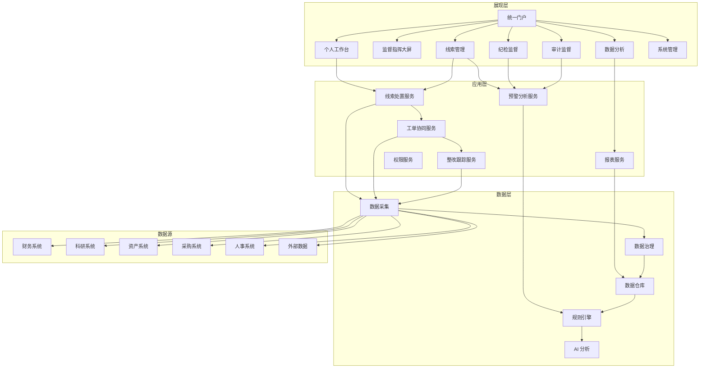
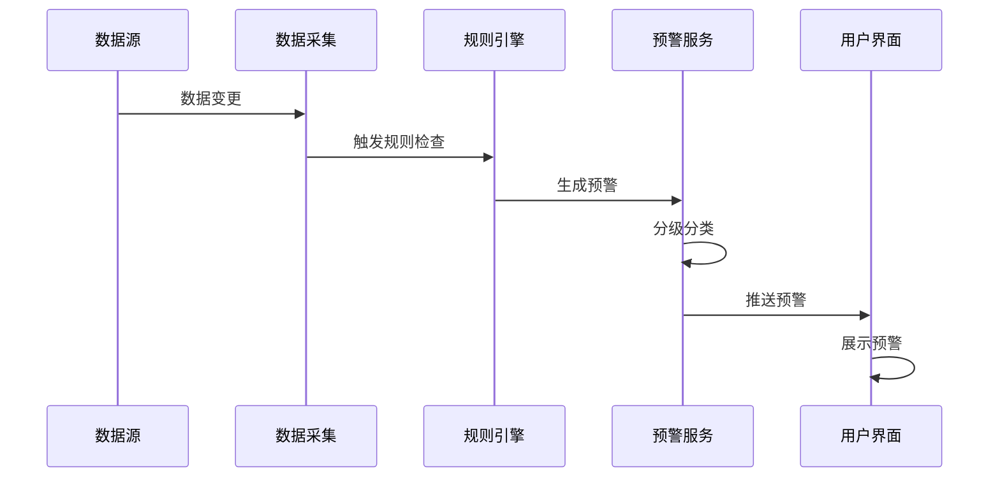
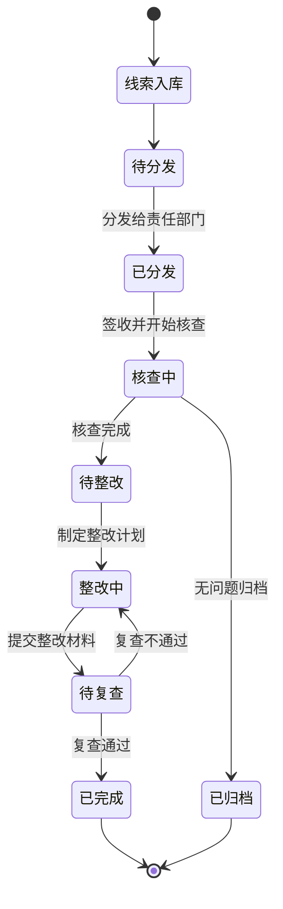

# 设计文档

## 概述

高校纪检审计监管一体化平台采用现代化的 Web 架构，面向 PC 端用户设计。系统以数据驱动为核心，通过统一门户、智能预警、协同处置、闭环管理的设计理念，为高校纪检审计工作提供全方位支持。

设计遵循以下原则：
- **专业严谨**: 符合政府机关和高校的视觉风格，体现权威性和专业性
- **高效便捷**: 优化工作流程，减少操作步骤，提升工作效率
- **数据可视**: 通过图表、看板、地图等方式直观展示监督态势
- **安全可控**: 严格的权限控制和数据安全保护机制

## 架构设计

### 系统架构



### 技术架构

- **前端**: HTML5 + Tailwind CSS + JavaScript (原型阶段)
- **图标**: Font Awesome 6.x
- **图表**: ECharts / Chart.js (数据可视化)
- **布局**: 响应式栅格布局，适配 1920x1080 及以上分辨率
- **交互**: 模态框、抽屉、下拉菜单等现代化交互组件

## 视觉设计规范

### 色彩系统

**主色调** - 政务蓝
- Primary: `#1E40AF` (蓝色-800) - 主要按钮、导航
- Primary Light: `#3B82F6` (蓝色-500) - 悬停状态
- Primary Dark: `#1E3A8A` (蓝色-900) - 激活状态

**辅助色**
- Success: `#10B981` (绿色-500) - 成功、已完成
- Warning: `#F59E0B` (黄色-500) - 警告、待处理
- Danger: `#EF4444` (红色-500) - 错误、高风险
- Info: `#06B6D4` (青色-500) - 信息提示

**中性色**
- Gray-50: `#F9FAFB` - 背景色
- Gray-100: `#F3F4F6` - 卡片背景
- Gray-200: `#E5E7EB` - 边框
- Gray-600: `#4B5563` - 次要文字
- Gray-900: `#111827` - 主要文字

### 字体规范

- **标题字体**: 思源黑体 / PingFang SC / Microsoft YaHei
- **正文字体**: 思源黑体 / PingFang SC / Microsoft YaHei
- **数字字体**: DIN / Arial

**字号层级**
- H1: 24px (页面标题)
- H2: 20px (区块标题)
- H3: 16px (卡片标题)
- Body: 14px (正文)
- Small: 12px (辅助信息)

### 间距规范

- 页面边距: 24px
- 卡片间距: 16px
- 内容间距: 12px
- 元素间距: 8px

### 圆角规范

- 卡片: 8px
- 按钮: 6px
- 输入框: 6px
- 标签: 4px

## 组件设计

### 导航系统

**顶部导航栏**
- Logo + 系统名称 (左侧)
- 全局搜索框 (中间)
- 消息通知 + 用户信息 (右侧)
- 高度: 64px
- 背景: 深蓝色渐变 (#1E3A8A → #1E40AF)

**侧边导航栏**
- 一级菜单: 图标 + 文字
- 二级菜单: 缩进展示
- 宽度: 240px (展开) / 64px (收起)
- 背景: 白色
- 选中状态: 蓝色背景 + 左侧边框

### 卡片组件

**统计卡片**
- 标题 + 数值 + 趋势图标
- 支持点击跳转
- 阴影: shadow-sm
- 悬停效果: shadow-md

**数据卡片**
- 标题栏 (带操作按钮)
- 内容区域
- 底部操作区 (可选)

### 表格组件

- 斑马纹行
- 悬停高亮
- 固定表头
- 分页器
- 行操作按钮 (查看、编辑、删除)
- 批量操作工具栏

### 表单组件

- 标签对齐: 右对齐
- 必填标识: 红色星号
- 验证提示: 输入框下方
- 按钮组: 右对齐

### 状态标签

- 待处理: 黄色
- 处理中: 蓝色
- 已完成: 绿色
- 已关闭: 灰色
- 超期: 红色

## 界面设计

### 1. 登录页面 (login.html)

**布局**
- 左侧: 系统宣传图 + 标语
- 右侧: 登录表单
- 背景: 渐变色 + 几何图案

**表单元素**
- 用户名输入框
- 密码输入框
- 验证码输入框
- 记住密码复选框
- 登录按钮
- 统一身份认证入口

### 2. 个人工作台 (dashboard.html)

**布局结构**
```
+--------------------------------------------------+
| 顶部导航栏                                          |
+--------+-----------------------------------------+
| 侧边栏  | 欢迎信息 + 快捷入口                           |
|        +-----------------------------------------+
|        | 统计卡片区 (4个)                             |
|        | - 待办事项 | 我的预警 | 整改任务 | 本月线索   |
|        +-----------------------------------------+
|        | 我的待办 (表格)                              |
|        +-----------------------------------------+
|        | 我的预警 (列表) | 最近动态 (时间线)           |
+--------+-----------------------------------------+
```

**功能区域**
1. 统计卡片: 数字 + 环比 + 迷你图表
2. 待办列表: 标题 + 类型 + 时限 + 操作
3. 预警列表: 预警内容 + 等级 + 来源 + 操作
4. 动态时间线: 时间 + 事件 + 操作人

### 3. 监督指挥大屏 (command-center.html)

**布局结构**
```
+--------------------------------------------------+
| 标题栏: 高校纪检审计监管一体化平台 - 监督指挥中心      |
+--------------------------------------------------+
| 顶部数据概览 (6个大数字卡片)                         |
+--------------------------------------------------+
| 左侧                | 中间              | 右侧      |
| - 预警趋势图         | - 风险地图         | - 问题分类 |
| - 单位风险排名       | - 实时预警滚动     | - 整改进度 |
+--------------------------------------------------+
```

**可视化组件**
- 折线图: 预警趋势
- 柱状图: 单位排名
- 饼图: 问题分类
- 地图: 风险热力图
- 进度环: 整改完成率
- 滚动列表: 实时预警

### 4. 线索库 (clue-library.html)

**布局结构**
```
+--------------------------------------------------+
| 顶部导航栏                                          |
+--------+-----------------------------------------+
| 侧边栏  | 搜索栏 + 筛选器                              |
|        +-----------------------------------------+
|        | 统计卡片 (总数、待处理、处理中、已完成)        |
|        +-----------------------------------------+
|        | 线索列表 (表格)                              |
|        | - 编号 | 标题 | 来源 | 风险等级 | 状态 | 操作 |
|        +-----------------------------------------+
|        | 分页器                                      |
+--------+-----------------------------------------+
```

**筛选器**
- 时间范围
- 来源类型
- 风险等级
- 处理状态
- 责任单位

**操作按钮**
- 查看详情
- 分发处置
- 合并线索
- 导出

### 5. 线索详情 (clue-detail.html)

**布局结构**
```
+--------------------------------------------------+
| 顶部导航栏                                          |
+--------+-----------------------------------------+
| 侧边栏  | 面包屑导航                                   |
|        +-----------------------------------------+
|        | 基本信息卡片                                 |
|        | - 编号、标题、来源、等级、状态等              |
|        +-----------------------------------------+
|        | 标签页                                      |
|        | [详细信息] [处置记录] [证据材料] [关联分析]   |
|        +-----------------------------------------+
|        | 操作按钮区                                   |
|        | [分发] [核查] [整改] [归档]                  |
+--------+-----------------------------------------+
```

**标签页内容**
- 详细信息: 描述、涉及对象、金额等
- 处置记录: 时间线展示处置过程
- 证据材料: 文件列表 + 预览
- 关联分析: 关系图谱

### 6. 预警处置中心 (alert-center.html)

**布局结构**
```
+--------------------------------------------------+
| 顶部导航栏                                          |
+--------+-----------------------------------------+
| 侧边栏  | 筛选器 + 快速操作                            |
|        +-----------------------------------------+
|        | 预警列表 (卡片式)                            |
|        | +--------------------------------------+ |
|        | | [高] 科研经费异常报销                    | |
|        | | 时间: 2025-10-20  来源: 规则引擎        | |
|        | | 涉及: 张三  金额: 50,000元              | |
|        | | [查看] [分发] [忽略]                    | |
|        | +--------------------------------------+ |
|        +-----------------------------------------+
```

**预警卡片**
- 风险等级标识 (颜色条)
- 预警标题
- 关键信息 (时间、对象、金额)
- 快速操作按钮

### 7. 工单管理 (work-order.html)

**布局结构**
```
+--------------------------------------------------+
| 顶部导航栏                                          |
+--------+-----------------------------------------+
| 侧边栏  | 工单状态统计                                 |
|        +-----------------------------------------+
|        | 搜索 + 筛选 + 新建工单                       |
|        +-----------------------------------------+
|        | 工单列表 (表格)                              |
|        | - 工单号 | 标题 | 类型 | 优先级 | 状态 | 操作 |
|        +-----------------------------------------+
```

**工单详情弹窗**
- 基本信息
- 核查组成员
- 任务分解
- 进度跟踪
- 讨论记录

### 8. 整改管理 (rectification.html)

**布局结构**
```
+--------------------------------------------------+
| 顶部导航栏                                          |
+--------+-----------------------------------------+
| 侧边栏  | 整改进度看板                                 |
|        | - 总数 | 进行中 | 已完成 | 超期            |
|        +-----------------------------------------+
|        | 整改任务列表                                 |
|        | - 任务 | 责任人 | 时限 | 进度 | 状态 | 操作 |
|        +-----------------------------------------+
```

**进度展示**
- 进度条
- 时间轴
- 里程碑节点
- 佐证材料

### 9. 纪检监督 (discipline-supervision.html)

**布局结构**
```
+--------------------------------------------------+
| 顶部导航栏                                          |
+--------+-----------------------------------------+
| 侧边栏  | 监督领域导航                                 |
|        | - 第一议题                                  |
|        | - 重大决策                                  |
|        | - 招生录取                                  |
|        | - 科研经费                                  |
|        | - 基建采购                                  |
|        | - 财务管理                                  |
|        | - 八项规定                                  |
|        | - 师德师风                                  |
|        | - 三重一大                                  |
|        +-----------------------------------------+
|        | 监督内容区 (根据选择的领域动态展示)           |
+--------+-----------------------------------------+
```

**监督内容**
- 监督指标卡片
- 预警列表
- 趋势图表
- 异常单位清单

### 10. 审计监督 (audit-supervision.html)

**布局结构**
```
+--------------------------------------------------+
| 顶部导航栏                                          |
+--------+-----------------------------------------+
| 侧边栏  | 审计领域导航                                 |
|        | - 预算执行                                  |
|        | - 科研经费                                  |
|        | - 三公经费                                  |
|        | - 采购管理                                  |
|        | - 固定资产                                  |
|        | - 招生学籍                                  |
|        | - 工程项目                                  |
|        | - 经济责任                                  |
|        | - 薪酬社保                                  |
|        | - IT治理                                   |
|        +-----------------------------------------+
|        | 审计内容区                                   |
+--------+-----------------------------------------+
```

### 11. 数据分析 (data-analysis.html)

**布局结构**
```
+--------------------------------------------------+
| 顶部导航栏                                          |
+--------+-----------------------------------------+
| 侧边栏  | 分析工具栏                                   |
|        | - 指标分析                                  |
|        | - 趋势分析                                  |
|        | - 关联分析                                  |
|        | - 图谱分析                                  |
|        +-----------------------------------------+
|        | 分析区域                                     |
|        | - 指标选择器                                |
|        | - 图表展示区                                |
|        | - 数据表格                                  |
|        +-----------------------------------------+
```

### 12. 报表中心 (report-center.html)

**布局结构**
```
+--------------------------------------------------+
| 顶部导航栏                                          |
+--------+-----------------------------------------+
| 侧边栏  | 报表分类                                     |
|        | - 我的报表                                  |
|        | - 订阅报表                                  |
|        | - 报表模板                                  |
|        +-----------------------------------------+
|        | 报表列表 + 预览                              |
+--------+-----------------------------------------+
```

### 13. 系统管理 (system-management.html)

**布局结构**
```
+--------------------------------------------------+
| 顶部导航栏                                          |
+--------+-----------------------------------------+
| 侧边栏  | 管理功能导航                                 |
|        | - 用户管理                                  |
|        | - 角色管理                                  |
|        | - 组织管理                                  |
|        | - 权限管理                                  |
|        | - 参数配置                                  |
|        | - 数据源管理                                |
|        | - 规则配置                                  |
|        | - 日志审计                                  |
|        +-----------------------------------------+
|        | 管理内容区                                   |
+--------+-----------------------------------------+
```

## 交互设计

### 操作反馈

- **加载状态**: 骨架屏 / 加载动画
- **成功提示**: 绿色 Toast 消息，2秒自动消失
- **错误提示**: 红色 Toast 消息，需手动关闭
- **确认操作**: 模态对话框二次确认

### 数据刷新

- **自动刷新**: 大屏每30秒刷新一次
- **手动刷新**: 刷新按钮 + 最后更新时间
- **实时推送**: WebSocket 推送新预警

### 快捷操作

- **批量操作**: 表格多选 + 批量操作栏
- **快捷键**: Ctrl+S 保存，Esc 关闭弹窗
- **右键菜单**: 表格行右键快捷菜单

### 响应式设计

- **最小分辨率**: 1366x768
- **推荐分辨率**: 1920x1080
- **侧边栏**: 支持收起/展开
- **表格**: 支持横向滚动

## 数据流设计

### 预警生成流程



### 线索处置流程



## 错误处理

### 错误类型

- **网络错误**: 显示重试按钮
- **权限错误**: 跳转到无权限页面
- **数据错误**: 显示错误信息 + 联系管理员
- **超时错误**: 自动重试 3 次

### 空状态

- **无数据**: 显示空状态插图 + 引导文案
- **搜索无结果**: 提示调整搜索条件
- **权限不足**: 提示联系管理员申请权限

## 性能优化

- **懒加载**: 图片、图表按需加载
- **虚拟滚动**: 长列表使用虚拟滚动
- **缓存策略**: 静态资源缓存
- **分页加载**: 表格数据分页加载

## 安全设计

- **水印**: 敏感页面添加用户水印
- **操作留痕**: 关键操作记录日志
- **会话超时**: 30分钟无操作自动登出
- **密码策略**: 强密码要求 + 定期修改

## 测试策略

- **功能测试**: 覆盖所有用户操作流程
- **兼容性测试**: Chrome、Edge、Firefox
- **性能测试**: 页面加载时间 < 3秒
- **安全测试**: XSS、CSRF 防护测试
